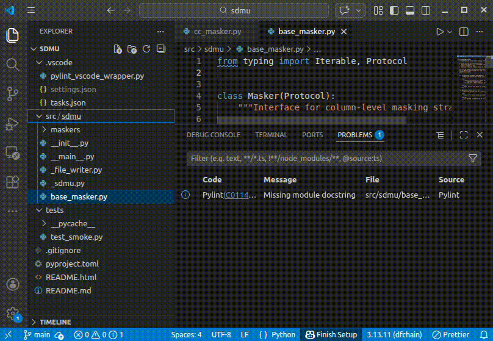
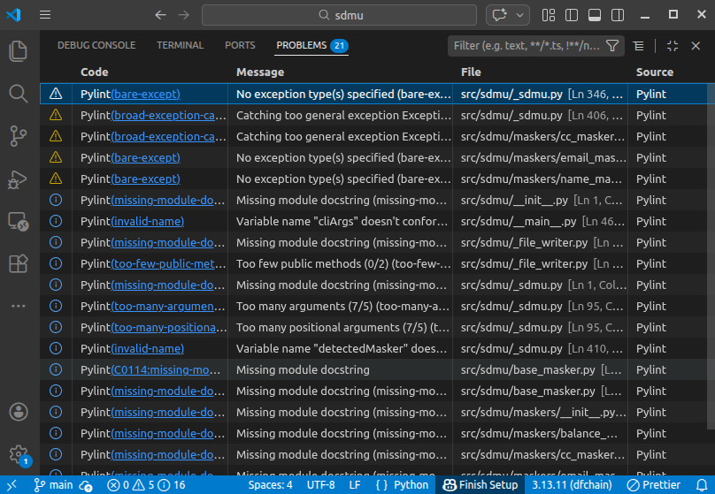
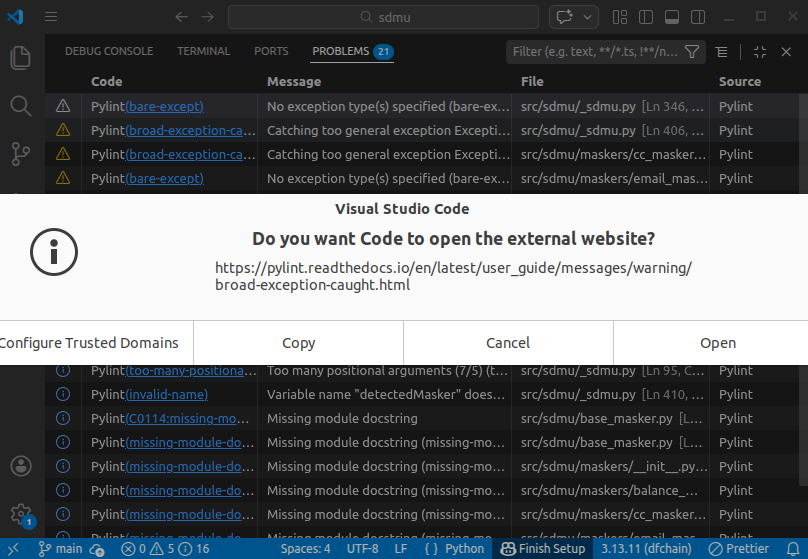

# Pylint Static Analysis

<p>
  <a href="https://marketplace.visualstudio.com/items?itemName=alexander-wei.python-pylint-static-analysis">
    
  </a>
  
  
  
</p>

#### Run pylint on entire packages without opening any files — Eclipse IDE‑style static code analysis in VS Code

This extension performs **workspace-wide** static analysis. It is not limited to open files like the standard lint-on-save behavior provided by many Python extensions.



## Why this extension exists

Most VS Code Python linting extensions only report problems for files that are currently open. That's fine for lightweight editing, but it's not how traditional IDEs work.

If you're coming from **Eclipse**, **IntelliJ**, or **PyCharm**, you expect:

- Static analysis across the entire project
- Diagnostics for files you haven't opened yet
- A single, authoritative Problems view for the workspace

#### Pylint Static Analysis restores that workflow in VS Code

This extension runs pylint across your workspace (or any folder/file) and publishes **rich, IDE-native diagnostics** for *all* Python files — not only the ones you've opened.



## What makes this different

This is not a replacement for the official ms-python.pylint integration. Instead, it's a workspace-level static analysis engine that runs pylint in batch (workspace) mode and publishes diagnostics in a VS Code native way.

| Feature                         | Standard lint-on-save | This extension |
| :---                            | :---                | :---           |
| Open files only                 | ✅                   | ❌              |
| Whole workspace analysis        | ❌                   | ✅              |
| Explorer folder linting         | ❌                   | ✅              |
| Rich diagnostics (codes + docs) | ✅                   | ✅              |
| Eclipse-style workflow          | ❌                   | ✅              |

## Key Features

### Project-wide static analysis

Run pylint across the entire workspace and see diagnostics for every file in the Problems view.

### Rich VS Code diagnostics

Issues are published via the VS Code diagnostics API (LSP-style), including:

- Pylint message codes
- Proper severity mapping
- Clickable documentation links (where available)
- Targeted runs (workspace, folder, file)



### Lint exactly what you want

You can lint:

- The whole workspace
- A specific folder
- A single file

You don't need to open files to see issues — diagnostics appear after analysis just like in a traditional IDE.

## Commands

- **Pylint: Run Whole Workspace** (Command Palette)

  Runs pylint across the entire workspace and publishes diagnostics for all Python files.

  Command ID: `pylintStatic.runWholeWorkspace`

- **Pylint: Run on File / Folder** (Explorer)

  Right-click a file or folder in the Explorer and run pylint on just that scope.

  Command ID: `pylintStatic.runResource`

- **Pylint: Clear Whole Workspace** (Command Palette)

  Clears all pylint diagnostics previously published by this extension.

  Command ID: `pylintStatic.clear`

## Configuration

All settings are under the `pylintStatic` namespace. Example settings (in your user or workspace settings.json):

```json
"pylintStatic.pylintPath": "/usr/bin/pylint",
"pylintStatic.usePythonModule": true,
"pylintStatic.enableAll": false,
"pylintStatic.recursive": true,
"pylintStatic.extraArgs": [
  "--disable=C0114,C0115,C0116",
  "--max-line-length=100"
]
```

Use `pylintStatic.usePythonModule` when pylint is installed inside a virtual environment and you prefer `python -m pylint`.

## Recommended usage pattern

Many users run this extension:

- On demand (for example, before commits or large refactors)
- Alongside standard lint-on-save tooling
- Instead of running pylint manually in a terminal

It pairs well with:

- CI / pre-commit hooks
- Ruff / Black / Pyright (each focused on a specific responsibility)

## Philosophy

VS Code is document-centric by default. This extension is project-centric by design.

If you want fast feedback while typing, use standard linting. If you want full static insight into your codebase, use this extension.

## Who this is for

- Developers coming from Eclipse / IntelliJ / PyCharm
- Large or legacy Python codebases
- Anyone tired of having to open files just to see errors

If you've ever asked, "Why doesn't VS Code show pylint errors for my whole project?" — this extension is for you.

## Notes

This extension intentionally runs pylint as a batch analysis tool. It may take longer than lint-on-save for large projects. Analysis is throttled to avoid excessive CPU usage.